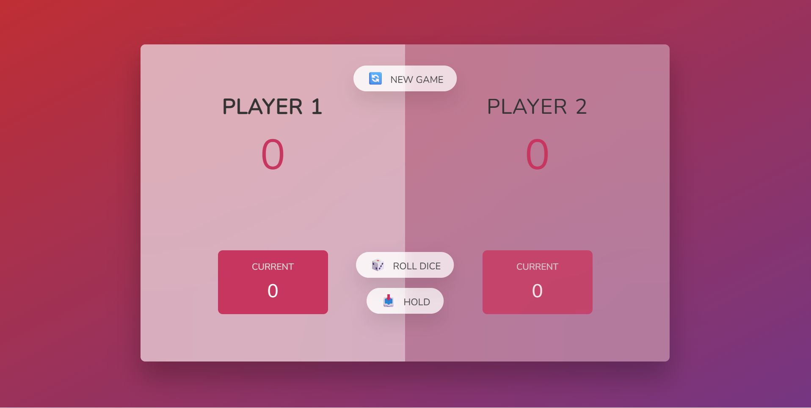
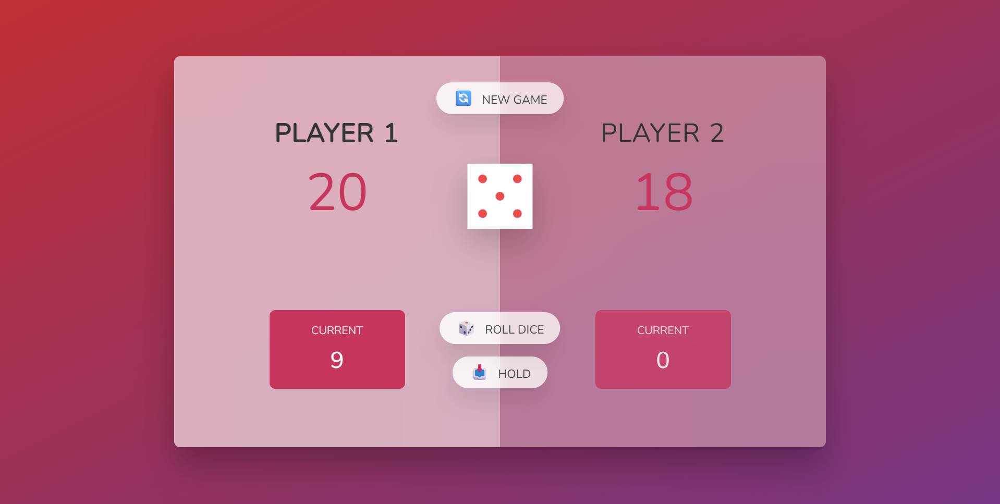
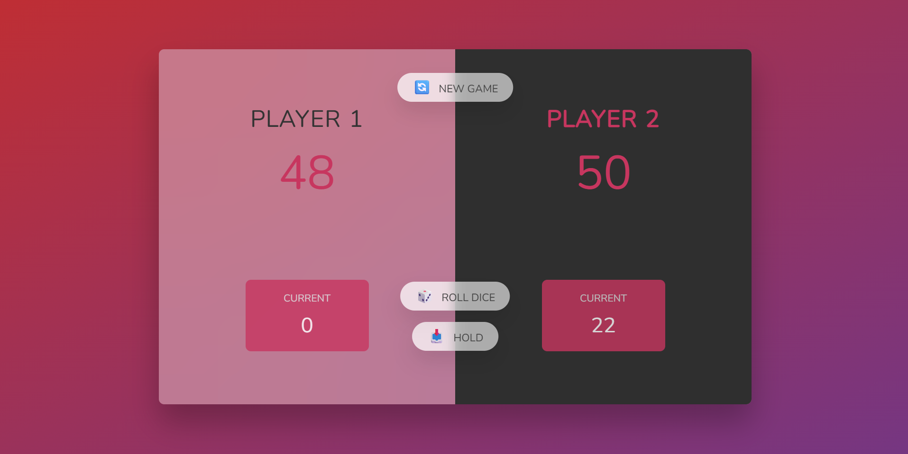

# 🎲 Rolling Game

A fun and interactive dice game built with JavaScript where players compete to reach the winning score by strategically rolling dice and managing risk.

Rolling Game combines simple game mechanics with dynamic user interactions, providing an engaging experience while demonstrating core JavaScript concepts and DOM manipulation techniques.

## 🚀 Live Demo

**Try it here:** https://mehdysadeghi.github.io/Rolling-Game/

---

## 📸 Preview

> Add screenshots of your application here.

### Game Board

```md id="q8z6mp"

```

### While Playing

```md

```

### Winning Screen

```md id="lm9d4t"

```

---

## ✨ Features

* 🎲 Random dice rolling
* 👥 Two-player gameplay
* 📊 Real-time score tracking
* 🔄 Turn switching system
* 🏆 Winning score detection
* 🎯 Strategic risk-and-reward mechanics
* 🎨 Dynamic UI updates
* ⚡ Fast and interactive gameplay

---

## 🛠️ Built With

* JavaScript (ES6+)
* HTML5
* CSS3
* DOM Manipulation

---

## 📂 Project Structure

```text
Rolling-Game/
│
├── styles.css
├── script.js
│
├── index.html
└── README.md
```

---

## ⚙️ Installation

Clone the repository:

```bash
git clone https://github.com/MehdySadeghi/Rolling-Game.git
```

Navigate to the project folder:

```bash
cd Rolling-Game
```

Open the project:

```text
index.html
```

For the best development experience, use VS Code Live Server.

---

## 🎓 What I Learned

This project helped me strengthen my understanding of:

* JavaScript fundamentals
* Event-driven programming
* DOM manipulation
* Application state management
* Conditional logic
* Game development concepts
* Dynamic UI rendering
* Writing clean and maintainable code

---

## 🔮 Future Improvements

Planned enhancements include:

* Single-player mode against AI
* Custom winning score selection
* Sound effects
* Dark mode support
* Online multiplayer mode
* Mobile-first redesign
* Leaderboard system
* Improved animations and visual effects

---

## 🤝 Contributing

Contributions, suggestions, and feedback are welcome.

Feel free to fork the repository and submit a pull request.

---

## 📄 License

This project is open source and available under the MIT License.

---

## 👨‍💻 Author

### Mehdy Sadeghi

Passionate Front-End Developer focused on building modern, responsive, and user-friendly web applications.

GitHub:
https://github.com/MehdySadeghi

Repository:
https://github.com/MehdySadeghi/Rolling-Game

---

### ⭐ If you found this project useful, consider giving it a star.
